# Salah for Windows

[](https://github.com/zainkhalid91/salah-windows-/releases/latest)


[](https://github.com/zainkhalid91/salah-windows-/actions/workflows/windows.yml)

**Prayer times, a live countdown and gentle reminders for Windows**, with a `salah` command for
the terminal. This is the Windows edition of [**Salah**](https://github.com/primayudantra/salah),
the macOS prayer clock by [Prima Yudantra](https://github.com/primayudantra). It has the same red
timeline, digital display, pixel digits, calculations and settings, rebuilt for Windows.

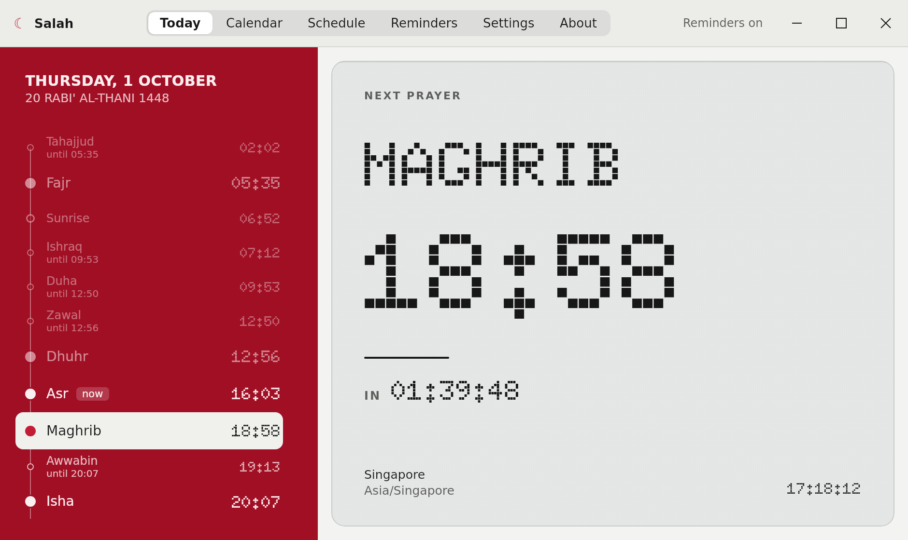

## ⬇ Download

| Installer | Link |
|---|---|
| **Windows installer (.exe)**, recommended | [**Download Salah-1.4.0.exe**](https://github.com/zainkhalid91/salah-windows-/releases/latest/download/Salah-1.4.0.exe) |
| Windows Installer package (.msi), for IT and managed PCs | [Download Salah-1.4.0.msi](https://github.com/zainkhalid91/salah-windows-/releases/latest/download/Salah-1.4.0.msi) |
| All versions and release notes | [Releases](https://github.com/zainkhalid91/salah-windows-/releases) |

Requires Windows 10 or 11 (64-bit). Java is bundled, so there's nothing else to install.

> **Calculated prayer times are approximations.** Your local mosque or authority may differ by a
> few minutes. Use the per-prayer offsets in Settings to match their timetable.

---

## Contents

- [Install](#install)
- [First launch](#first-launch)
- [Features](#features)
- [Screenshots](#screenshots)
- [The notification area icon](#the-notification-area-icon)
- [Reminders](#reminders)
- [Keyboard shortcuts](#keyboard-shortcuts)
- [The `salah` command](#the-salah-command)
- [Settings and configuration](#settings-and-configuration)
- [Troubleshooting](#troubleshooting)
- [Uninstall](#uninstall)
- [Privacy](#privacy)
- [How it was made](#how-it-was-made)
- [Build from source](#build-from-source)
- [Project layout](#project-layout)
- [Credits and licenses](#credits-and-licenses)

---

## Install

1. **Download** [`Salah-1.4.0.exe`](https://github.com/zainkhalid91/salah-windows-/releases/latest/download/Salah-1.4.0.exe).
2. **Run it.** Windows may show *"Windows protected your PC"* because the installer isn't
   code-signed yet. Click **More info → Run anyway**.
3. **Follow the installer.** Salah installs for your user account only, so it doesn't ask for
   administrator rights. You can change the install folder if you like.
4. **Open Salah** from the Start menu or the desktop shortcut.

**Updating:** Salah checks for new versions once a day (**About → Updates**). Click **Install** to
download the new installer and run it. You can also install a newer `.exe` over the old one; your
settings are kept.

## First launch

The first time it opens, Salah asks which language you want: **English** or **العربية** (Arabic).
You can change it any time in **Settings → Language**.

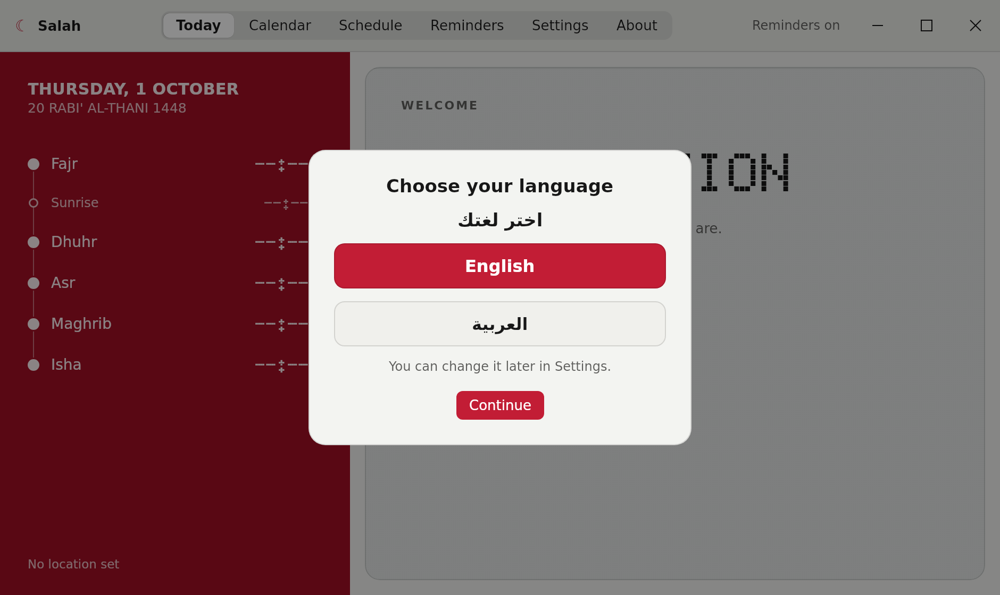

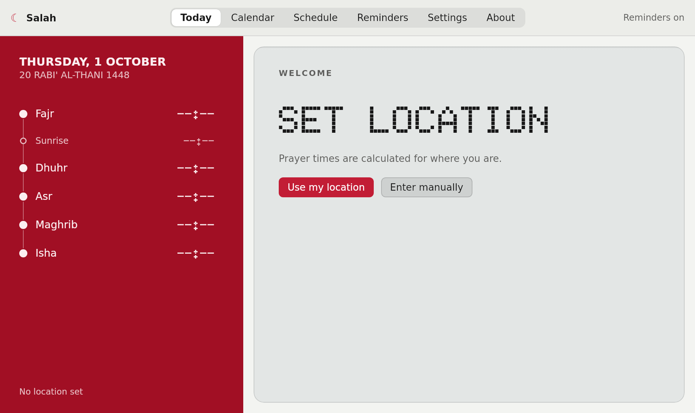

Salah needs to know where you are to calculate prayer times:

- **Use my location** asks Windows Location Services. If nothing happens, turn on
  **Settings → Privacy & security → Location → Let desktop apps access your location**.
- **Enter manually** lets you search for your city, or type latitude, longitude and a time zone.

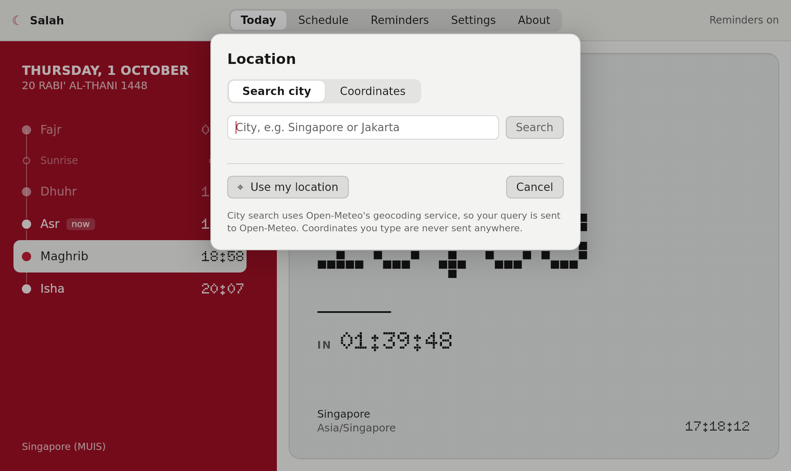

The calculation method is chosen automatically: **MUIS** in Singapore and the **Muslim World
League** elsewhere. You can change it in **Settings**, along with the Asr madhab, high-latitude
rule and per-prayer offsets.

Salah then adds itself to **Start with Windows** and to the notification area (☾), so reminders
keep arriving after you close the window.

## Features

- **Today at a glance**: the next prayer in big pixel digits with a live countdown, and the day's
  timeline from Fajr to Isha. Sunrise is shown as the end of Fajr.
- **Sunnah times**: Tahajjud (the last third of the night), Ishraq, Duha (Chasht), Zawal,
  Awwabin and Islamic midnight on the same timeline, each with when its window ends. Click one to
  see what it is. They can be hidden in Settings.
- **English or Arabic**: the whole app, including the tray, reminders and calendar, in English or
  Arabic, right to left in Arabic.
- **NOW window**: for 15 minutes after a prayer begins (adjustable, 0–60), the display shows it as
  NOW with the time since it started.
- **Gregorian and Hijri dates**: Umm al-Qura calendar, with a ±2 day adjustment for local moon
  sighting.
- **Islamic calendar**: a Hijri or Gregorian month view with both dates in every day, a converter
  that works both ways, and every Islamic date of the year (Islamic New Year, Ashura, Mawlid,
  Isra and Mi'raj, Shab-e-Barat, Ramadan, Laylat al-Qadr, both Eids, Arafah and more). The
  selected day shows the Hijri month's number too, e.g. *22 Rabi' al-Thani (4) 1448 AH*.
- **Islamic date alerts**: a notification for each new Islamic month and for special days, at
  Maghrib the evening before (when the Islamic day begins) or on the morning of the day. The white
  days (13th to 15th) are optional.
- **Jumuah on Fridays**: Dhuhr is relabelled on Fridays (you can turn this off).
- **Prayer details**: click any prayer for its reminder, method and offset.
- **Preview any date**: click the date to pick a day from a calendar.
- **Schedule**: day, week or month tables, with copy to clipboard and export to **CSV** or a
  calendar file (**ICS**) for Outlook or Google Calendar.
- **Reminders**: an early reminder (5–30 min) and/or one at prayer time, per prayer. Also quiet
  hours, pause, a soft chime or the system sound, and a test button.
- **13 calculation methods**: MUIS, Muslim World League, ISNA, Egypt, Umm al-Qura, Karachi, Dubai,
  Kuwait, Qatar, Moonsighting Committee, Turkey, Tehran, or custom Fajr/Isha angles. Also the
  Shafi'i or Hanafi Asr, and high-latitude rules.
- **Light and dark**: follows Windows' app mode live, including a dark title bar, or set it by hand.
- **Works offline**: times are calculated on your PC. Only city search, "Use my location" and the
  update check go online.
- **Polar-safe**: where the sun doesn't rise or set, Salah shows "—" and explains why. It never
  invents a time.
- **`salah` CLI**: the same times, countdowns and settings in Terminal or PowerShell.
- **Tiny footprint**: the countdown ticks only while a Salah window is visible; otherwise it wakes
  once a minute.

## Screenshots

| Next prayer | NOW, after a prayer starts |
|---|---|
|  | 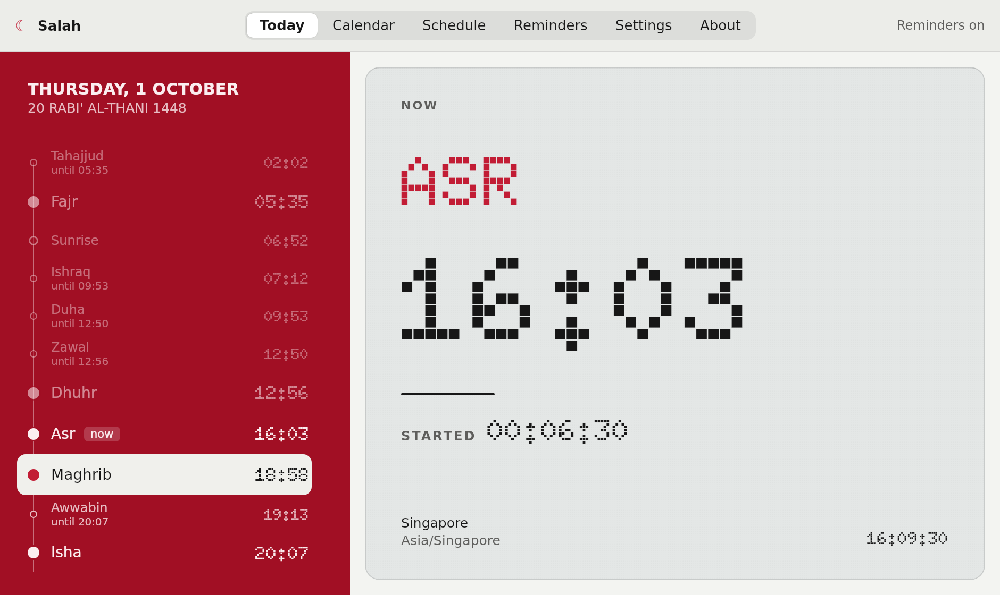 |
| **Prayer detail** | **Previewing another date** |
| 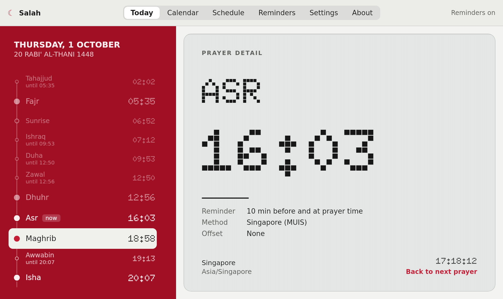 | 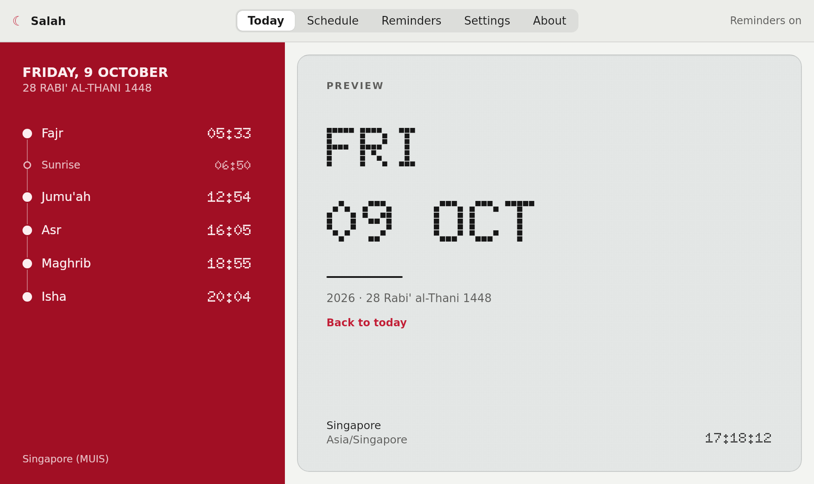 |
| **Schedule (week, CSV/ICS export)** | **Reminders** |
| 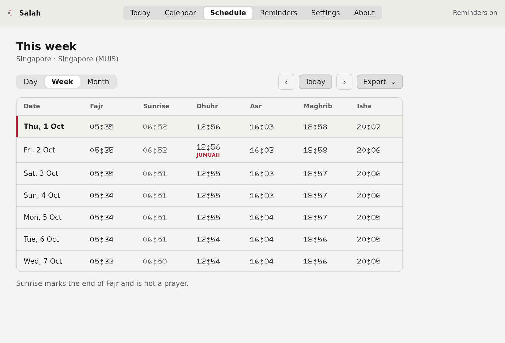 | 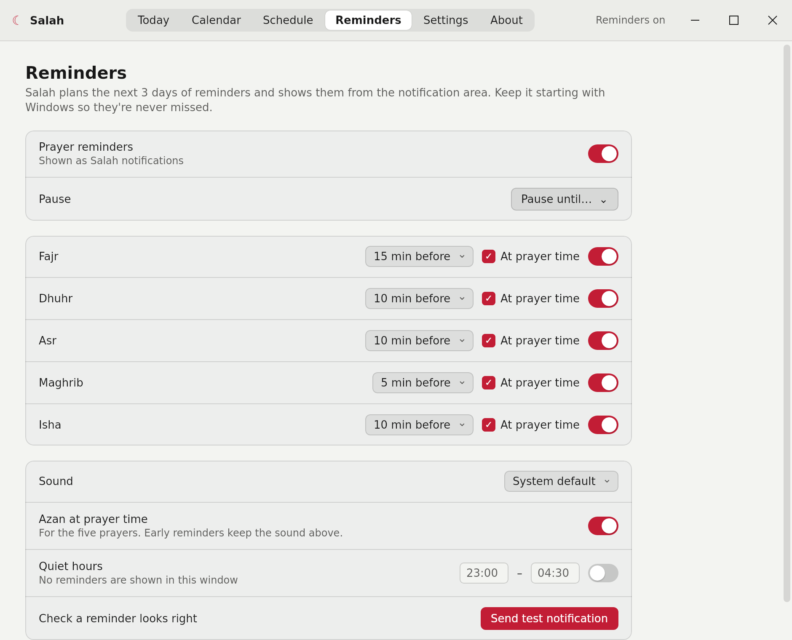 |
| **Sunnah times (Tahajjud selected)** | **Salah in Arabic** |
| 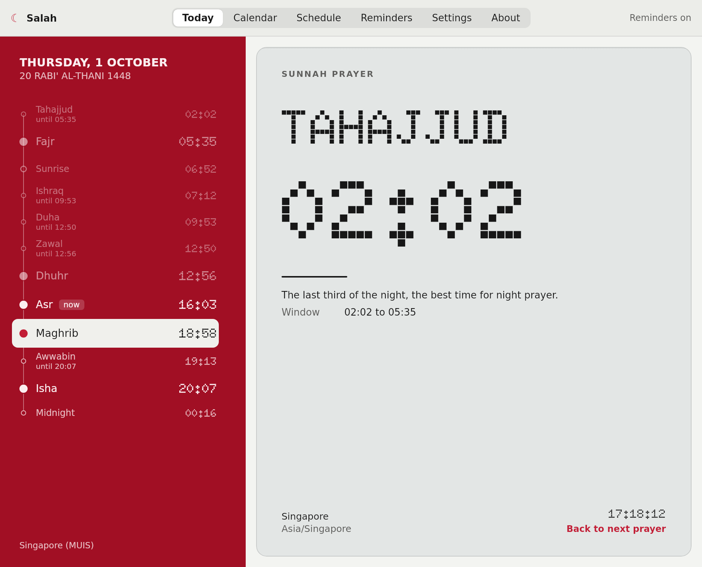 | 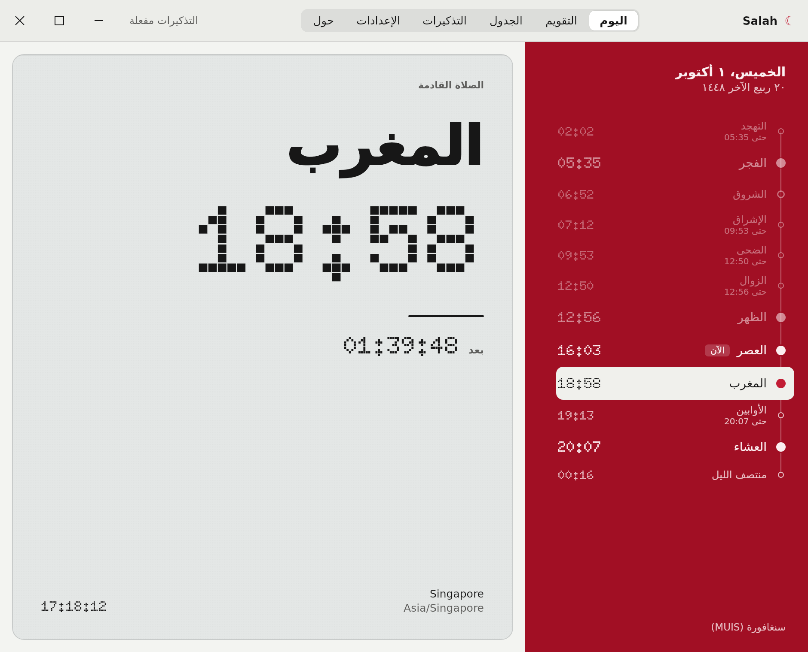 |
| **Islamic calendar** | **The calendar in Arabic** |
| 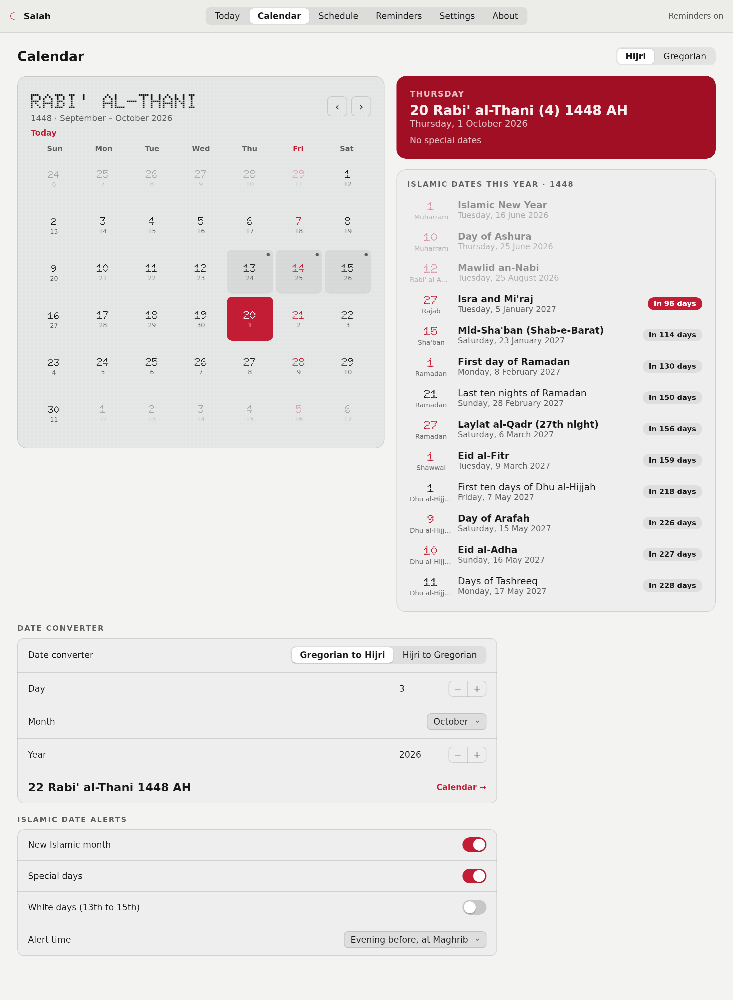 | 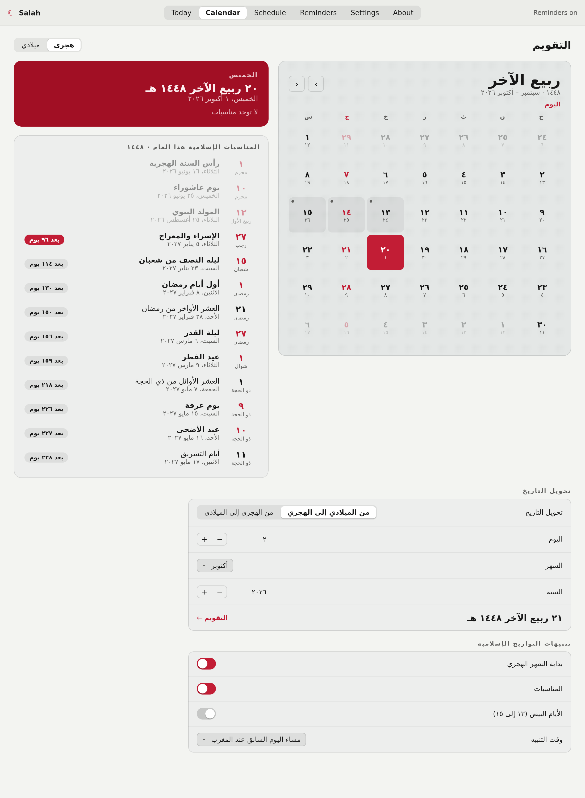 |
| **Settings** | **About** |
| 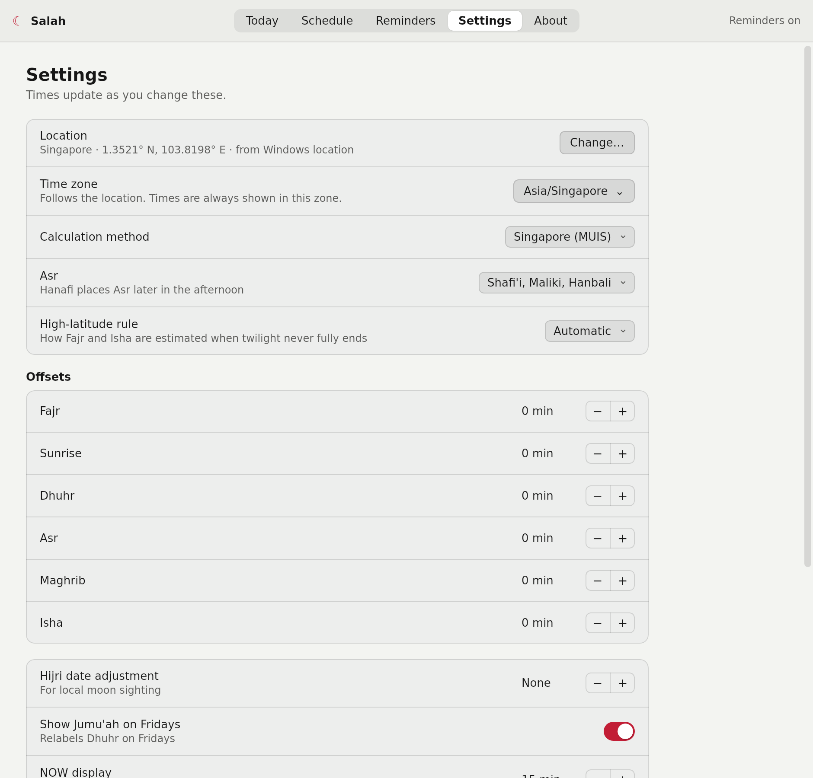 | 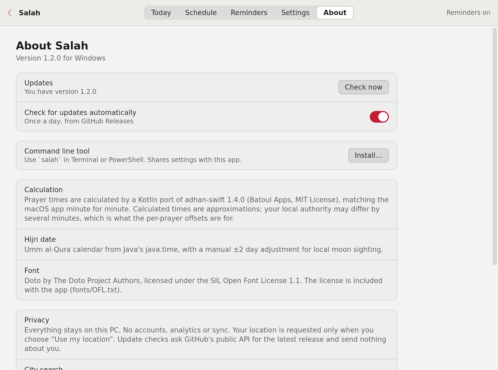 |

<details>
<summary>Narrow window and dark mode</summary>

| Narrow window (stacks below 760 px) | Dark mode |
|---|---|
| 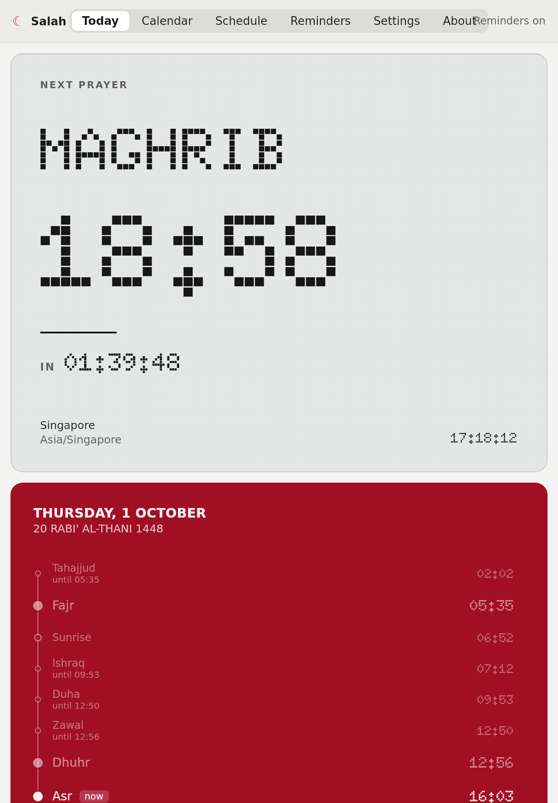 | 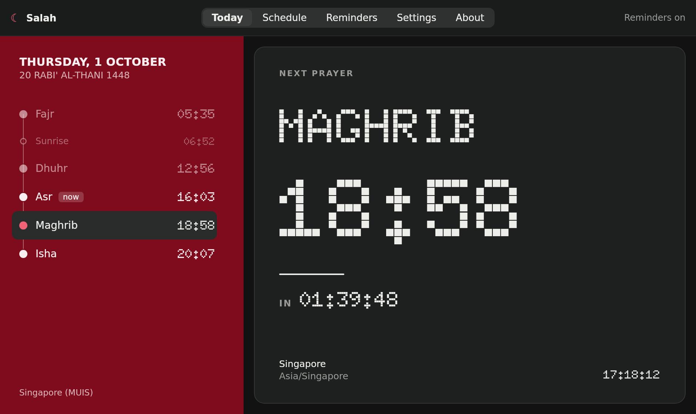 |

</details>

## The notification area icon

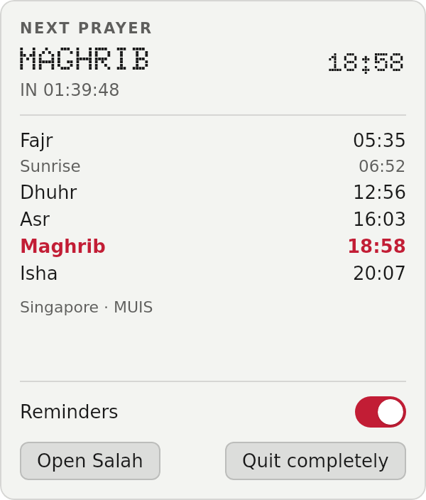

When Salah is running, its ☾ icon sits in the notification area at the bottom-right of the taskbar.
If you don't see it, click the **^** arrow and drag the icon onto the taskbar.

- **Point at it** to see the next prayer, e.g. *☾ Asr · 12m*. You can change this in **Settings →
  Notification area** to show the name and countdown, the time, or the icon only.
- **Click it** to open the panel: next prayer, countdown, today's times, the reminders switch,
  **Open Salah** and **Quit completely**.
- **Double-click it** to open the main window.
- **Right-click it** for a menu: Open Salah, turn reminders on or off, Quit Salah completely.

**Closing the window doesn't quit Salah.** It keeps running in the notification area so reminders
arrive. To stop it, use **Quit completely** (in the panel, the right-click menu, or Ctrl+Shift+Q).
If you turn the notification-area icon off, closing the window quits Salah.

<br clear="right">

## Reminders

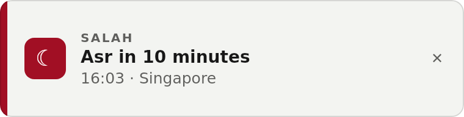

Reminders appear in the bottom-right corner with the sound you chose, e.g. *"Asr in 10 minutes ·
4:05 PM · Singapore"*. Click a reminder to open Salah.

- The **azan** plays when each of the five prayers begins. Early reminders and Islamic date alerts
  keep the sound you chose. Turn it off in **Reminders → Azan at prayer time**.
- Salah plans the next **3 days** of reminders and tops them up continuously.
- Reminders arrive **while Salah is running**, normally from the notification area. Keep **Start
  with Windows** on (Settings) so they're never missed.
- **Quiet hours** skip reminders in a window (e.g. 23:00–04:30). **Pause** stops them for an hour,
  until tomorrow, or until a time you choose.
- **Send test notification** (Reminders screen) checks that the reminder looks and sounds right.

## Keyboard shortcuts

| Shortcut | Action |
|---|---|
| **Ctrl+1 … Ctrl+5** | Today, Schedule, Reminders, Settings, About |
| **Ctrl+,** | Settings |
| **Ctrl+W** or **Ctrl+Q** | Close the window (Salah keeps running in the notification area) |
| **Ctrl+Shift+Q** | Quit Salah completely |
| **Esc** | Today: back to the next prayer (from a prayer's details or a preview) |
| **T** | Today: back to today · Schedule: jump to today |
| **← / →** | Schedule: previous / next day, week or month |
| **D / W / M** | Schedule: day, week or month view |

## The `salah` command

Salah includes a command-line tool that shares its settings. To install it, open **About → Command
line tool → Install…**, then open a **new** Terminal or PowerShell window:

```text
> salah
╭────────────────────────────────────────────╮
│  SALAH                                     │
│  THURSDAY, 1 OCTOBER 2026                  │
│  20 RABI' AL-THANI 1448                    │
│  SINGAPORE · MUIS                          │
├────────────────────────────────────────────┤
│  NEXT PRAYER                               │
│  MAGHRIB  18:58  IN 01:39:48               │
├────────────────────────────────────────────┤
│  Fajr       05:35                          │
│  Sunrise    06:52                          │
│  Dhuhr      12:56                          │
│  Asr        16:03                          │
│  Maghrib    18:58   ◀ next                 │
│  Isha       20:07                          │
╰────────────────────────────────────────────╯
```

| Command | What it does |
|---|---|
| `salah` / `salah today` | Today's times and the next prayer (`--date YYYY-MM-DD` for another day) |
| `salah next` | Next prayer and countdown; `--watch` refreshes every second |
| `salah schedule` | A day; `--week` or `--month` for a table |
| `salah location` | Show the location; `salah location set Jakarta` or `--lat … --lon … --tz …` |
| `salah setup` | Interactive first-run setup |
| `salah config` | List every setting; `get <key>`, `set <key> <value>`, `path`, `reset` |
| `salah reminders` | Reminder status; `enable` / `disable` (optionally `--prayer asr`) |

Every read command accepts `--json` (a stable schema with ISO 8601 times), `--compact` (one line,
handy for prompts), `--plain` and `--no-color`. Exit codes: **0** success, **1** error, **2**
invalid usage, **3** no location or unreadable config. Run `salah --help` for more.

```powershell
salah config set calculation.method singapore
salah config set calculation.offsets.isha 2
salah config set reminders.asr.leadMinutes 15
salah next --compact          # Maghrib 18:58 (1h 39m)
```

Changes from the CLI appear in the running app within a second.

## Settings and configuration

Everything you set lives in one JSON file, shared by the app and the CLI:

```
%APPDATA%\Salah\config.json
```

It uses the same format as the macOS app, so a `config.json` copied from a Mac works unchanged.
The file is written atomically and watched, so edits from any source show up live. If it ever
becomes unreadable, Salah shows a **Reset to defaults** screen instead of crashing.

| Setting | Options |
|---|---|
| Location and time zone | City search, Windows location, or coordinates; times always use the location's zone |
| Calculation method | Automatic or any of the 13 methods; custom Fajr/Isha angles |
| Asr | Shafi'i, Maliki, Hanbali, or Hanafi (later Asr) |
| High-latitude rule | Automatic, middle of the night, seventh of the night, twilight angle |
| Offsets | −60 to +60 minutes per prayer |
| Hijri adjustment | −2 to +2 days |
| Jumuah, NOW window, clock | Relabel Fridays; 0–60 min NOW display; 12- or 24-hour |
| Appearance | System, Light, Dark |
| Start with Windows, notification area | On/off, plus the tooltip style |

## Troubleshooting

<details>
<summary><b>"Windows protected your PC" when installing</b></summary>

The installer isn't code-signed yet. Click **More info → Run anyway**. The download comes from this
repository's GitHub Releases, built by the public
[Actions workflow](https://github.com/zainkhalid91/salah-windows-/actions/workflows/windows.yml).
</details>

<details>
<summary><b>Salah doesn't start, or shows an error</b></summary>

Startup errors are shown in a dialog and saved to `%APPDATA%\Salah\crash.log`. Please
[open an issue](https://github.com/zainkhalid91/salah-windows-/issues) with that file attached.
</details>

<details>
<summary><b>I don't get reminders</b></summary>

- Check that the ☾ icon is in the notification area (Salah is running).
- **Reminders** screen: the main switch is on, the prayer's switch is on, and it isn't paused or in
  quiet hours.
- **Settings → Start with Windows** is on.
- Try **Send test notification**.
</details>

<details>
<summary><b>"Use my location" doesn't work</b></summary>

Turn on **Settings → Privacy & security → Location**, including **Let desktop apps access your
location**. Or use **Enter manually** to search for your city.
</details>

<details>
<summary><b>Times differ from my mosque</b></summary>

Pick the method your local authority uses (Settings → Calculation method). Then fine-tune each
prayer with **Offsets**. In the far north or south, try another **High-latitude rule**.
</details>

<details>
<summary><b>`salah` isn't recognized in the terminal</b></summary>

Run **About → Command line tool → Install…**, then open a **new** terminal window. Opening a new
window is needed because Windows only picks up the PATH change in new windows.
</details>

## Uninstall

Go to **Settings → Apps → Installed apps → Salah → Uninstall**. Your settings remain in
`%APPDATA%\Salah`; delete that folder to remove them too.

## Privacy

Everything stays on your PC. There are no accounts, analytics, tracking or sync.

- Prayer times are calculated locally.
- **City search** sends only your search text to [Open-Meteo](https://open-meteo.com/)'s free
  geocoding service.
- **Use my location** asks Windows for your coordinates, then sends them to Open-Meteo (for the time
  zone) and [BigDataCloud](https://www.bigdatacloud.com/) (for the place name). This happens only
  when you click the button.
- **Update checks** ask GitHub's public API for the latest release and send nothing about you.

---

## How it was made

Salah began as a macOS app by **Prima Yudantra**: a Swift and SwiftUI menu-bar prayer clock with a
companion CLI ([primayudantra/salah](https://github.com/primayudantra/salah)). **Zain Khalid**
brought it to Windows in collaboration with Prima, with the goal of making it *exactly the same*
app. It has the same look, numbers, behaviour and config file, built natively for Windows.

The port was built with [Claude Code](https://claude.com/claude-code), Anthropic's AI coding agent,
working from the original Swift source, its design spec and its test suite.

### The approach

| macOS original | Windows edition | Why |
|---|---|---|
| Swift, SwiftUI | **Kotlin**, **Compose Multiplatform for Desktop** | A modern declarative UI like SwiftUI, GPU-rendered with Skia, which makes the pixel-perfect design straightforward |
| adhan-swift 1.4.0 | **A line-by-line Kotlin port of adhan-swift 1.4.0** | The same arithmetic gives the same minute on both platforms. The available JVM libraries lack Tehran's Maghrib angle and differ in defaults. |
| Foundation calendars | `java.time` (Umm al-Qura Hijri, IANA time zones) | Built in and DST-correct |
| swift-argument-parser CLI | Kotlin CLI with the same commands and output | Scripts and prompts work the same on both |
| Menu bar extra | Notification-area icon, tooltip and panel | The Windows equivalent |
| UNUserNotificationCenter | Salah's own reminder toasts, timed by the app | Full control of the look and sound, with no native code |
| SMAppService login item | `HKCU\…\Run` startup entry | Per user, no admin rights needed |
| CLGeocoder / Core Location | Open-Meteo, BigDataCloud / Windows Location Services | No API keys, free |
| `.app` bundle | `.exe` / `.msi` built by `jpackage` with a bundled Java runtime | One download, nothing else to install |

### How we know it matches

- **The calculation is verified, not assumed.** The test suite includes the macOS app's own
  reference times, which match exactly. It also cross-checks **2,100 prayer times** (10 methods ×
  7 cities × 5 seasons) against Batoul Apps' independent adhan-java library, each within a minute.
  Polar days, DST changes, midnight rollover, Jumu'ah, the NOW window and the reminder planner are
  tested too (40 tests).
- **The design was checked screen by screen.** An offscreen renderer (`--snapshot`) draws every
  screen in light and dark, and those images were compared against the original design mock. The
  screenshots in this README come from it.
- **Every build is tested on Windows.** GitHub Actions builds the installers on Windows, runs the
  bundled `salah` command, and launches the installed app for 10 seconds to make sure it starts.

### Things we solved along the way

- **Pixel font legibility:** Doto is a variable font. Lighter weights shrink the dots until small
  digits look hollow on Windows, so Salah ships a static Black cut.
- **Dark mode to the edges:** Windows draws the title bar itself, so Salah asks DWM for a dark
  title bar and re-reads Windows' app mode live.
- **A `salah` command without a second Java:** the CLI runs on the Java runtime bundled with the app,
  through a small `salah.cmd` that also switches the console to UTF-8 for the box drawing.
- **A friendly crash screen:** Windows' generic "Failed to launch JVM" is replaced by a dialog and
  `crash.log`, and CI launches the packaged app on every build so start-up problems never ship.

## Build from source

You need **JDK 21** (Temurin, or the JDK bundled with Android Studio or IntelliJ IDEA). Gradle
downloads everything else.

```powershell
git clone https://github.com/zainkhalid91/salah-windows-.git
cd salah-windows-\windows

.\gradlew :app:run              # run the app
.\gradlew :core:test            # calculation, config and planner tests
.\gradlew :cli:installDist      # CLI at cli\build\install\salah\bin\salah.bat
.\gradlew :app:packageExe       # installer at app\build\compose\binaries\main\exe\
.\gradlew :app:packageMsi       # installer at app\build\compose\binaries\main\msi\
.\gradlew :app:run --args="--snapshot shots"   # render every screen to PNG
```

**In IntelliJ IDEA or Android Studio:** choose **File → Open** and select the **`windows`** folder,
not the repository root. Set the Gradle JDK to 21, then run **app → Tasks → compose desktop →
run** from the Gradle panel.

**Releases:** pushing a tag such as `windows-v1.2.1` makes
[the workflow](.github/workflows/windows.yml) build and test the installers and publish them as a
GitHub Release. The in-app updater picks it up from there. Bump `appVersion` in
`windows/app/build.gradle.kts` and `VERSION` in `SalahInfo.kt` first.

## Project layout

```
.
├── windows/                   ← Salah for Windows (Kotlin, Gradle)
│   ├── core/                  pure Kotlin: adhan port, config, schedules, Hijri, exporters,
│   │                          reminder planner, single-instance lock  (+ tests)
│   ├── cli/                   the salah command
│   ├── app/                   Compose Desktop UI, notification area, toasts, Windows integration
│   │   └── packaging/         installer icon and salah.cmd
│   └── docs/screenshots/
├── .github/workflows/windows.yml   CI: tests, snapshots, installers, self-test, releases
├── Sources/, App/, Tests/     the original macOS app (Swift), unchanged
├── README.macOS.md            the original macOS README
└── SPEC.md                    the product spec both editions follow
```

## Credits and licenses

- **Salah for macOS:** [Prima Yudantra](https://github.com/primayudantra) ·
  [primayudantra/salah](https://github.com/primayudantra/salah)
- **Windows edition:** [Zain Khalid](https://github.com/zainkhalid91), in collaboration with Prima
  Yudantra, built with [Claude Code](https://claude.com/claude-code)
- **Prayer calculation:** ported from [adhan-swift](https://github.com/batoulapps/adhan-swift) by
  Batoul Apps, MIT License. The notice is kept in `windows/core/src/main/kotlin/salah/core/adhan/Adhan.kt`.
- **Pixel font:** [Doto](https://github.com/oliverlalan/Doto) by The Doto Project Authors, SIL Open
  Font License 1.1 (`windows/app/src/main/resources/fonts/OFL.txt`)
- **Azan clip:** from islamcan.com, as supplied by the project owner
  (`windows/app/src/main/resources/sounds/salah-azan.wav`)
- **UI toolkit:** [Compose Multiplatform](https://www.jetbrains.com/compose-multiplatform/) by
  JetBrains · [JNA](https://github.com/java-native-access/jna)
- **Location services:** [Open-Meteo](https://open-meteo.com/) geocoding,
  [BigDataCloud](https://www.bigdatacloud.com/) reverse geocoding

For the macOS app, its CLI and its own documentation, see [README.macOS.md](README.macOS.md).
