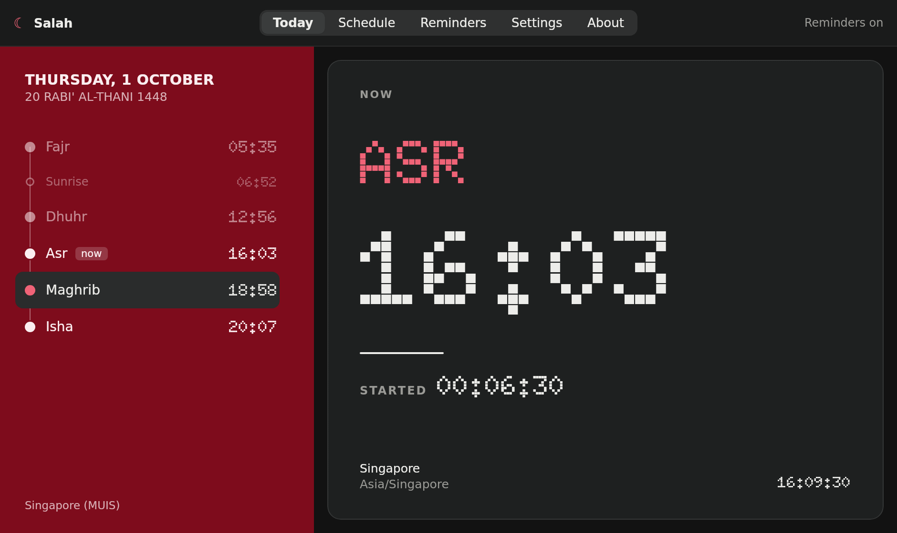
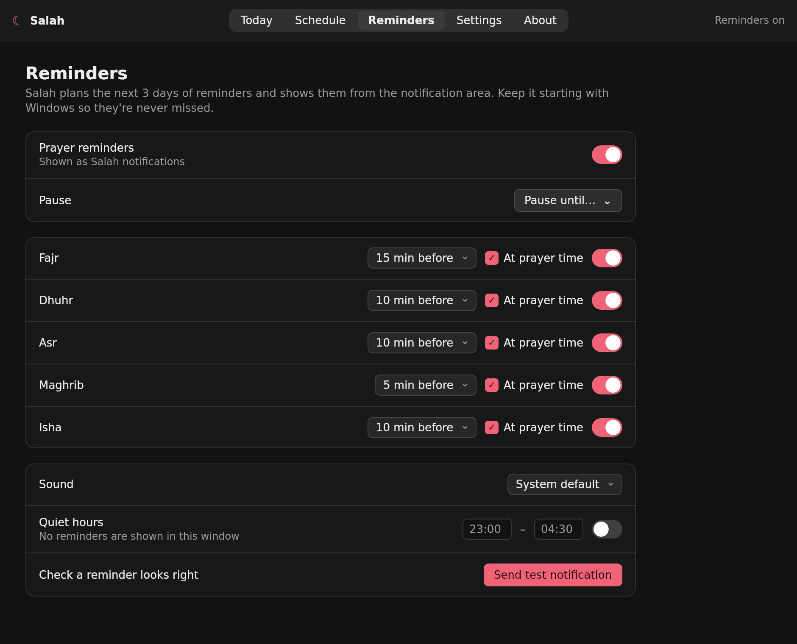

# Salah for Windows

The Windows edition of [Salah](../README.md): the same prayer-time dashboard, reminders and `salah`
command line tool as the macOS app. It's built with Kotlin and Compose Multiplatform for Desktop, and
shares the macOS app's design, behaviour and config format.


| NOW window, dark | Schedule |
|---|---|
|  |  |
| **Reminders** | **Notification area panel and reminder toast** |
|  |   |

## Install

Download `Salah-<version>.msi` from the
[Windows releases](https://github.com/zainkhalid91/salah/releases) and run it. It installs per user
(no admin prompt) with a Start menu entry. The installer bundles its own Java runtime, so there's nothing
else to install.

On first launch, choose **Use my location** (Windows Location Services) or **Enter manually** (city
search or coordinates).

Close the window and Salah keeps running in the notification area (☾), so reminders arrive. Point at
the icon to see "☾ Asr · 12m". Click it for today's times and the reminders switch, double-click it to
open the window, and right-click it to **Quit Salah completely**.

## What's the same as on macOS

- **Calculation:** the prayer times come from a step-for-step Kotlin port of adhan-swift 1.4.0, the
  library the macOS app uses. All 13 methods are supported, including Tehran's Maghrib angle, along
  with the madhab, high-latitude rules and per-prayer offsets. The test suite checks the port against
  the macOS reference values and against Batoul Apps' adhan-java (2,100 cross-checked times).
- **Dashboard:** the crimson timeline, the dot-matrix display in the Doto pixel font, NEXT/NOW,
  countdown, TOMORROW, Jumu'ah on Fridays, the Umm al-Qura Hijri date with a ±2 day adjustment, prayer
  detail, date preview, and the narrow stacked layout.
- **Screens:** Today, Schedule (day/week/month; copy, CSV, ICS), Reminders, Settings and About, in light
  and dark.
- **Reminders:** the 3-day rolling plan, deterministic ids, lead time plus at-time per prayer, quiet
  hours, pause, sound and a test notification. The copy reads the same, e.g. "Asr in 10 minutes" /
  "4:05 PM · Singapore".
- **Config:** the same JSON keys and values. A `config.json` from the Mac loads unchanged.
- **CLI:** the same `salah` commands, flags, box output, JSON schema and exit codes.

## What's Windows-specific

| macOS | Windows |
|---|---|
| Menu bar extra | Notification area icon + panel; the tooltip shows "☾ Asr · 12m" |
| UNUserNotificationCenter | Salah draws its own toast in the screen corner. It runs while Salah is in the notification area, which starts with Windows. |
| Login item (SMAppService) | `HKCU\…\Run` entry ("Start with Windows") |
| CLGeocoder | Open-Meteo geocoding for city search and time zones, BigDataCloud to name a coordinate |
| Core Location | Windows Location Services (System.Device.Location via PowerShell) |
| `~/Library/Application Support/Salah/config.json` | `%APPDATA%\Salah\config.json` |
| ⌘1–5, ⌘Q, ⌥⌘Q | Ctrl+1–5, Ctrl+W / Ctrl+Q (close to the notification area), Ctrl+Shift+Q (quit completely) |
| Self-update from GitHub Releases | Checks this repo's releases daily; **Install** downloads the MSI and hands it to Windows Installer |

## Command line

In the app, go to **About → Command line tool → Install…** to add `salah` to your PATH. Then, in a
new terminal:

```text
> salah
╭────────────────────────────────────────────╮
│  SALAH                                     │
│  THURSDAY, 1 OCTOBER 2026                  │
│  20 RABI' AL-THANI 1448                    │
│  SINGAPORE · MUIS                          │
├────────────────────────────────────────────┤
│  NEXT PRAYER                               │
│  MAGHRIB  18:58  IN 01:39:48               │
├────────────────────────────────────────────┤
│  Fajr       05:35                          │
│  Sunrise    06:52                          │
│  Dhuhr      12:56                          │
│  Asr        16:03                          │
│  Maghrib    18:58   ◀ next                 │
│  Isha       20:07                          │
╰────────────────────────────────────────────╯
```

`salah next --watch`, `salah schedule --month --json`, `salah config set calculation.method singapore`,
`salah reminders disable --prayer fajr` and the other commands behave exactly as on macOS; run
`salah --help`. Changes take effect in the running app immediately.

The `salah` command needs no separate install: `salah.cmd` runs the CLI on the Java runtime bundled
with the app.

## Build from source

You need JDK 21. The Gradle wrapper fetches everything else.

```powershell
cd windows
.\gradlew :core:test            # calculation, config, planner tests
.\gradlew :app:run              # run the app
.\gradlew :cli:installDist      # CLI at cli\build\install\salah\bin\salah.bat
.\gradlew :app:packageMsi       # installer at app\build\compose\binaries\main\msi\
```

To render every screen to PNG without a display (as CI does), run
`.\gradlew :app:run --args="--snapshot snapshots"`.

GitHub Actions (`.github/workflows/windows.yml`) runs the tests, renders the snapshots, builds the MSI
and EXE on `windows-latest`, and smoke-tests the bundled `salah` command. Pushing a tag like
`windows-v1.2.0` publishes the installers as a GitHub release.

## Layout

```
windows/
  core/   pure Kotlin: adhan port, config store + keys, schedules, NOW/next, Hijri,
          exporters, notification planner, single-instance lock
  cli/    the salah command
  app/    Compose Desktop UI, notification area, toasts, Windows integration
```

## Credits

- Salah for macOS by [Prima Yudantra](https://github.com/primayudantra/salah). The Windows port was
  made in collaboration with him.
- Prayer calculation ported from [adhan-swift](https://github.com/batoulapps/adhan-swift) by Batoul
  Apps (MIT; the notice is kept in `core/src/main/kotlin/salah/core/adhan/Adhan.kt`).
- [Doto](https://github.com/oliverlalan/Doto) by The Doto Project Authors (SIL OFL 1.1; see
  `app/src/main/resources/fonts/OFL.txt`).
